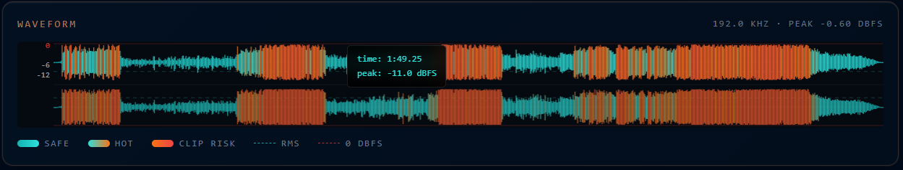
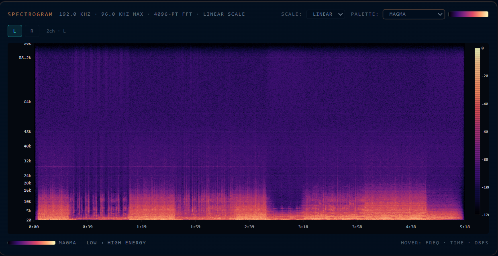
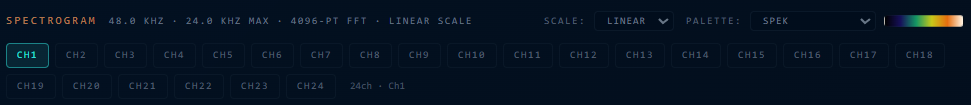

# Audio Veritas

Web-based audio analysis tool running entirely in the browser — no uploads, no servers. Supports lossless formats (FLAC, MQA, ALAC, WAV, AIFF), surround/Dolby codecs (AC-3, EC-3, E-AC-3 JOC, AC-4/Atmos), Sony 360 Reality Audio / MPEG-H 3D Audio, and more.

**Live:** https://audioveritas.pages.dev

## Formats Supported

| Format | Decoder | Bit-Perfect |
|--------|---------|:-----------:|
| FLAC / MQA | libFLAC.js (WASM) | ✅ |
| MP3 | mpg123 (WASM) | — |
| OGG Vorbis | libvorbis (WASM) | — |
| WAV / AIFF | Native binary parser | ✅ |
| M4A (ALAC) | FFmpeg WASM + mp4box.js | ✅ |
| M4A (AAC) | FFmpeg WASM + mp4box.js | — |
| AC-3 / EC-3 / E-AC-3 JOC (Dolby) | Browser native (MSE) + FFmpeg fallback | ✅ |
| AC-4 / Atmos IMS | Patched FFmpeg WASM | — |
| Sony 360RA / MPEG-H 3D | Ittiam libmpegh / Fraunhofer IIS | ✅ |
| Opus | FFmpeg WASM | — |
| WMA / APE / WavPack / DTS | FFmpeg WASM | — |

## Project Architecture

```
├── public/
│   ├── sw.js                      # Service worker (cache-first + network-first)
│   ├── libflac.min.js / .wasm.js  # libFLAC WASM glue + memory file
│   ├── decode-mpegh3da.js / .wasm  # Ittiam libmpegh WASM decoder
│   ├── fraunhofer-mpegh.js / .wasm # Fraunhofer FDK WASM decoder
│   └── ffmpeg-*.js / .wasm        # FFmpeg WASM builds (AAC, AC-3, AC-4, etc.)
│
└── src/
    ├── lib/
    │   ├── audioAnalysis.ts        # Core DSP: FFT, DR14, True Peak, bit-depth, spectrogram
    │   ├── wasmDecoders.ts        # Decoder routing: FLAC→WASM, MP3→mpg123, M4A→FFmpeg, etc.
    │   ├── mpegh3daDecoder.ts     # Ittiam MPEG-H / Sony 360RA decoder (WASM)
    │   ├── fraunhoferMpeghDecoder.ts # Fraunhofer FDK MPEG-H decoder (WASM)
    │   ├── ac4Decoder.ts           # AC-4 / Atmos IMS decoder (patched FFmpeg WASM)
    │   ├── tagParser.ts            # Binary tag parsing: ID3v2, Vorbis Comment, iTunes ilst
    │   ├── useSpatialMetadata.ts   # MPEG-H OAM spatial object metadata extractor
    │   ├── dolbyMp4Fragmenter.ts   # Dolby MP4 fragmentation utilities
    │   ├── emscriptenIsolate.ts    # Emscripten module isolation for FFmpeg
    │   ├── mpeghWorkerClient.ts    # Web Worker client for background MPEG-H decoding
    │   ├── utils.ts                # General utilities
    │   └── __tests__/
    │       ├── dsp.test.ts         # Unit tests: True Peak, DR14, bit-depth, upsampling, FFT
    │       └── calibration.test.ts # Calibration tests: 24-bit FLAC, lossy transcode, padded 16-bit
    │
    ├── components/
    │   ├── AnalysisResults.tsx     # Main results panel — assembles all analysis outputs
    │   ├── SpectrogramCanvas.tsx   # FFT spectrogram with multi-channel support
    │   ├── WaveformCanvas.tsx      # Stereo waveform with RMS/clip visualization
    │   ├── MediaInfoPanel.tsx       # Full metadata display (tags, encoding, lyrics)
    │   │                            # Sections: General, Audio Stream, Encoding/App,
    │   │                            # Tags (Identity, Credits, Release, Track Info, Original, Artwork),
    │   │                            # Encoding Details (fake detection, MQA, MD5), Lyrics panel
    │   └── ui/                     # Radix UI primitives (button, dialog, input, label, separator, tabs, tooltip)
    │
    ├── routes/
    │   ├── __root.tsx              # Root layout: SW registration, FFmpeg/libflac preload
    │   └── index.tsx               # Main app page
    │
    ├── workers/
    │   └── mpeghDecodeWorker.ts    # Background worker for MPEG-H decoding
    │
    └── hooks/
        └── use-mobile.tsx          # Mobile device detection
```

## Visualizations

### Waveform
Stereo split-lane waveform showing peak envelope per time bin. Left and right channels drawn in separate lanes with a shared centre line.



- **Colour coding:** Teal = safe, orange = hot, red = clip risk
- **RMS dashed reference lines** showing time-averaged loudness
- **0 dBFS clip lines** at top and bottom
- **Hover tooltip** showing time and peak dBFS
- **Per-bar format:** `[Lmax, Lmin, Rmax, Rmin]` — captures peak+valley for envelope

### Spectrogram
Full FFT spectrogram with bilinear interpolation for smooth time/frequency resolution.




- **Multi-channel support:** Per-channel tabs for multichannel files (>2ch); LFE channel highlighted separately
- **5 colour palettes:** Spek (default), Jet/Rainbow, Magma, Inferno, Viridis
- **Linear and logarithmic frequency scales**
- **Fixed 0 to −120 dBFS range** (like Spek) — avoids noise-floor-only scaling
- **Per-channel FFT:** 4096-point FFT minimum for high frequency resolution at 192kHz
- **Hover tooltip:** freq · time · level (dBFS)
- **dB legend bar** on right side with −120 to 0 dBFS tick marks

### Spatial Metadata Overlay (MPEG-H OAM)
Top-down 360° polar diagram showing object positions. Rendered from MPEG-H OAM (Object Audio Metadata) in the bitstream.


- **Dot size** encodes elevation (larger = higher)
- **Opacity** encodes gain (0–100%)
- **Object index number** on each dot
- **Compact table** listing azimuth, elevation, gain per object
- **Cardinal labels:** FRONT, BACK, L, R

## Authenticity Verification System

The **VerdictCard** performs a composite fake/transcode detection by evaluating multiple signal properties:

### Verdict States
| State | Colour | Meaning |
|-------|--------|---------|
| `genuine` | Teal (#2FE0DA) | Lossless — no lossy encoding detected |
| `inconclusive` | Purple (#A78BFA) | Some signals present but not conclusive |
| `suspicious` | Orange (#F97316) | Something looks off |
| `fake` | Red (#EF4444) | Confirmed lossy transcode / fraud |
| `defective` | Orange (#F97316) | Header mismatch / truncated audio |

### Detection Signals
- **Actual Bitrate** 
- **Frequency Cutoff** 
- **Edge Slope (dB/oct)** 
- **Cutoff σ (Hz)** 
- **HF Energy above cutoff** 
- **Confidence %** 
- **Reasons list** 

### Integrity Conditions
A file is marked **Authentic** only when:
- No fake detection flags triggered
- No upsampling detected
- No bit-depth padding detected
- No clipping detected

## Audio Analysis Features

### DR14 (Dynamic Range) — ITU-R BS.1770-4 / Netflix trail method

### True Peak (BS.1770-4)

### Bit-Depth Detection (dual-pronged)

### Spectral Cutoff Detection

### Upsampling Detection

### Noise Floor Estimation

### Integrated Loudness (K-weighted BS.1770)

### MQA Detection
Detected by examining FLAC STREAMINFO metadata and LSB patterns. 

### Lyrics Parsing
Parses and displays LRC `[mm:ss.xx]` timestamps, TTML word-level timestamps `<mm:ss.xx>`, multi-language translations, and romanization. Strips timestamps for clean display; groups lines by timestamp for synced display.

### Phase & M/S Detection

## WASM Decoders

### libflacjs (FLAC / MQA)
- **Source:** `public/libflac.min.js` or `public/libflac.min.wasm.js`
- **Origin:** Pre-built Emscripten build of libFLAC
- **Purpose:** Bit-perfect FLAC decoding, preserves LSBs for MQA detection
- **Loading:** Injected via `<script>` tag, sets `window.Flac`

### mpg123 (MP3)
- **Package:** `mpg123-decoder` (npm)
- **Purpose:** MP3 decoding at native sample rate

### libvorbis / opus-decoder (OGG)
- **Packages:** `@wasm-audio-decoders/ogg-vorbis`, `opus-decoder`
- **Purpose:** OGG Vorbis and raw Opus decoding

### FFmpeg WASM
- **Source:** `@ffmpeg/core` loaded from jsDelivr CDN
- **Purpose:** AAC, ALAC, WMA, APE, WavPack, DTS, AC-3/E-AC-3 fallback
- **Loading:** Fetched from CDN, instantiated via Emscripten factory

### MP4 / M4A Parsing (GPAC / MP4Box)
- **Tool:** [GPAC](https://github.com/gpac/gpac/wiki/mp4box) — `MP4Box`
- **Package:** `mp4box` (npm, used in-browser via `import('mp4box')`)
- **Purpose:** Extracts audio tracks from MP4/M4A containers for ALAC and AAC decoding via FFmpeg WASM
- **Install (CLI):** `apt install gpac` or https://gpac.wp.imt.fr/downloads/
- **Decoder chain:** `mp4box.js` demux → ALAC binary PCM / AAC → FFmpeg WASM

```bash
# CLI example: extract audio track from M4A
MP4Box -raw 1 input.m4a -out output.alac
```

### MPEG-H / Sony 360RA Decoders
Two WASM decoders available (user selects via dialog):

1. **Ittiam libmpegh** 
2. **Fraunhofer IIS** 

Both decode Sony 360 Reality Audio and MPEG-H 3D Audio bitstreams. Fraunhofer preserves all channels (up to 24+) at full quality — no downmixing.

> **Note:** When converting Dolby Atmos / MPEG-H metadata to raw PCM output, spatial positioning metadata is lost — however **all audio data is preserved bit-for-bit**. The raw output contains all channels (up to 128 object-based beds and templates), just without the spatial rendering instructions.

### AC-4 / Atmos IMS Decoder
- **Source:** — patched FFmpeg build with AC-4 support
- **Purpose:** Decodes AC-4 / Immersive Music Stereo streams

> **Note:** AC-4 decoder is proprietary and is not open-sourced — limitations of AC-4 IMS & AC-4 exist. Might not work as intended.

---

## Building Your Own WASM Decoders

> **Individual decoder build commands** — the most up-to-date and tested build instructions for each decoder are maintained in their own repositories. Before attempting to build any decoder, check its source repo first:
> - **libflac** — https://github.com/xiph/flac
> - **FFmpeg WASM** — https://github.com/ffmpegwasm/ffmpeg.wasm
> - **libmpegh (Ittiam MPEG-H)** — https://github.com/ittiam-systems/libmpegh
> - **Fraunhofer mpeghdec** — https://github.com/Fraunhofer-IIS/mpeghdec
> - **GPAC / MP4Box** — https://gpac.wp.imt.fr/downloads/
>
> The commands below are general Emscripten reference syntax — always defer to a decoder's own README for required patches, CMake flags, and known issues.

### Toolchain

| Tool | Purpose | Install |
|------|---------|---------|
| **Emscripten** (emcc/em++) | Compile C/C++ to WebAssembly | `git clone https://github.com/emscripten-core/emsdk.git && ./emsdk install latest && ./emsdk activate` |
| **CMake** | Build system for projects with Makefiles | `apt install cmake` or download from cmake.org |
| **Ninja** | Fast build system (optional, faster than Make) | `apt install ninja-build` |
| **GCC / G++** | GNU C/C++ compiler | `apt install build-essential` |
| **MinGW-w64** | Windows cross-compiler (for .wasm on Linux/Mac) | `apt install mingw-w64` |
| **GPAC / MP4Box** | MP4 container manipulation (CLI) | `apt install gpac` or https://gpac.wp.imt.fr/downloads/ |

### Emscripten Essential Commands

```bash
# Activate Emscripten (run once per shell session)
source /path/to/emsdk/emsdk_env.sh

# Basic C → WASM compilation
emcc input.c -o output.js          # outputs JS + Wasm
emcc input.c -o output.wasm        # outputs Wasm only (no glue JS)

# With optimization
emcc input.c -O3 -o output.js

# With WebAssembly output
emcc input.c -s WASM=1 -o output.js

# With Emscripten modules (FS, etc.)
emcc input.c -s WASM=1 -s EXPORTED_RUNTIME_METHODS="[ccall,cwrap,FS]" -o output.js

# Standalone Wasm (no JS glue) — use when loading manually
emcc input.c -s STANDALONE_WASM=1 -o output.wasm

# Specify memory size
emcc input.c -s INITIAL_MEMORY=16777216 -s MAXIMUM_MEMORY=33554432 -o output.js

# With locateFile (for loading .wasm separately)
emcc input.c -s WASM=1 -s EXPORTED_RUNTIME_METHODS="[ccall,cwrap]" -o output.js
```

### Building libflac (Example)

```bash
git clone https://github.com/xiph/flac.git
cd flac

emcmake cmake .. -DBUILD_CXXLIBS=OFF -DBUILD_EXAMPLES=OFF -DBUILD_TESTING=OFF
emmake make -j$(nproc)

# Output: libflac*.bc or libflac*.a → link with emcc
emcc libflac/.libs/libflac.a -o libflac.js \
    -s WASM=1 \
    -s EXPORTED_RUNTIME_METHODS="[ccall,cwrap,FS]" \
    -s ALLOW_MEMORY_GROWTH=1 \
    -O3
```

### Building FFmpeg (WASM)

FFmpeg WASM builds are complex — requires heavy patching for browsers. See:
- https://github.com/ffmpegwasm/ffmpeg.wasm
- https://github.com/nicknisi/dotfiles/blob/main/workstation/bin/ffmpeg-build.sh

### Building libmpegh (Ittiam MPEG-H)

```bash
git clone https://github.com/ittiam-systems/libmpegh
cd libmpegh

emcmake cmake ..
emmake make

emcc testbench/mpegh_testbench.c \
    -o mpegh-testbench.js \
    -s WASM=1 \
    -s EXPORTED_RUNTIME_METHODS="[ccall,cwrap,FS]" \
    -s ALLOW_MEMORY_GROWTH=1 \
    -s INITIAL_MEMORY=33554432 \
    -O3
```

### Common Emscripten Flags Reference

| Flag | Purpose |
|------|---------|
| `-s WASM=1` | Output WebAssembly instead of asm.js |
| `-s STANDALONE_WASM=1` | Output standalone .wasm with no JS glue |
| `-s EXPORTED_RUNTIME_METHODS` | Expose runtime methods (ccall, cwrap, FS) |
| `-s EXPORTED_FUNCTIONS` | Export specific C functions |
| `-s ALLOW_MEMORY_GROWTH=1` | Allow heap to grow dynamically |
| `-s INITIAL_MEMORY=X` | Set initial memory (bytes) |
| `-s MAXIMUM_MEMORY=X` | Set max memory |
| `-s MODULARIZE=1` | Wrap output in ES module |
| `-s EXPORT_ES6=1` | ES6 module export |
| `-s ENVIRONMENT='web,worker'` | Target web/worker environments |
| `-s USE_PTHREADS=1` | Enable threads |
| `-s PROXY_TO_PTHREAD=1` | Proxy main thread to worker |
| `-s WASM_BIGINT=1` | Enable BigInt support |
| `--no-entry` | No main() function required |
| `-s LZ4=1` | LZ4 compression support |
| `-s BINARYEN=1` | Use Binaryen for optimization |

### Loading Wasm Manually (fetch + instantiate)

```javascript
// Fetch raw .wasm file
const response = await fetch('/my-decoder.wasm');
const bytes = await response.arrayBuffer();

// Instantiate with WebAssembly.instantiate
const { instance } = await WebAssembly.instantiate(bytes, imports);
const { myFunction } = instance.exports;

// Or with emscripten module:
const Module = {
  locateFile: (path) => path.endsWith('.wasm') ? '/my-decoder.wasm' : '/' + path,
};
```

---

## Testing

The project includes a comprehensive DSP test suite using Vitest covering calibration, dynamic range, true peak, spectrogram analysis, bit-depth detection, upsampling detection, and more.

```bash
npm run test      # run all tests
```

### Test Categories

**Calibration Tests** (`src/lib/__tests__/calibration.test.ts`)
- Genuine 24-bit FLAC detection (LSB entropy ≥6.0, authentic=true, spectral cutoff >18kHz)
- Lossy transcode in FLAC (cutoff 13–19kHz, HF energy <−30dB, brick-wall slope <−5 dB/oct)
- 16-bit padded to 24-bit (effectiveBits=16, authentic=false, LSB entropy <2.0)
- True Peak accuracy (full-scale sine, quiet signals)
- DR14 algorithm accuracy (constant signal, block distribution, peak/RMS values)

**DSP Unit Tests** (`src/lib/__tests__/dsp.test.ts`)
- `computeTruePeak`: ISP detection, sine wave accuracy, silence, DC signals, high-frequency risk
- `computeTtDrForChannel`: DR calculation with sine-reference offset, block counting, peak/RMS accuracy
- `detectSpectralCutoff`: full-bandwidth detection, energy profile generation, stationary noise
- `measureCutoffSlope`: edge cases (empty spectrum, boundary bins)
- `detectCutoffStability`: stationary signal variance, per-window cutoff tracking
- `measureEnergyAboveCutoff`: empty spectrum, Nyquist boundary
- `analyzeBitDepth`: 16/24/32-bit detection, authentic vs. padded, LSB entropy range
- `detectUpsampling`: all candidate rates 44.1k–384kHz, high-rate signal handling
- `estimateNoiseFloor`: silence vs. loud signal
- `cutoffToBitrate`: known frequency-to-bitrate mappings (32–320 kbps)

---

## Development

```bash
npm install
npm run dev       # dev server
npm run build     # production build
npm run lint      # lint
npm run test      # run tests
```

## No Backend

This app runs **100% client-side**. No data is ever sent to a server. Audio files are analyzed entirely in the browser using WebAssembly decoders.

## Credits

| Project | License | Link |
|---------|---------|------|
| **MQA Detection** | MIT | https://github.com/purpl3F0x/MQA_identifier |
| **Ittiam libmpegh** | Proprietary | https://github.com/ittiam-systems/libmpegh |
| **Fraunhofer IIS mpeghdec** | Proprietary | https://github.com/Fraunhofer-IIS/mpeghdec |
| **GPAC / MP4Box** | LGPL | https://github.com/gpac/gpac/wiki/mp4box |
| libFLAC | BSD | https://xiph.org/flac/ |
| mpg123 | LGPL | https://mpg123.de/ |
| FFmpeg WASM | LGPL/GPL | https://ffmpeg.org/ |

## License

This project is licensed under the [MIT License](./LICENSE).
This project is released as-is for **educational and personal use**.

- Core project: MIT License  
- Audio Veritas components: MIT License  
- External decoders: See their respective licenses  

> ⚠️ Some audio decoders (e.g., Dolby, MPEG-H) may be proprietary and subject to their own licensing terms.
